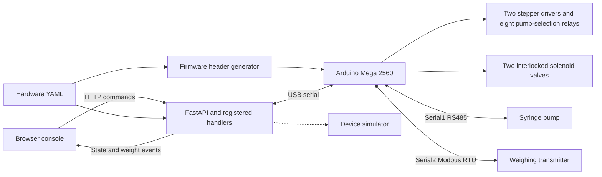

# Autonomous Laboratory for Automated Solution Preparation and Quantitative Analysis

A laboratory automation system for liquid preparation, gravimetric dosing, and instrument control, developed at the Plasma Engineering Laboratory, National Taiwan University.

The primary implementation is **Autonomous Laboratory v6**: a FastAPI service, a browser console designed for touch operation, and Arduino Mega 2560 firmware. The backend coordinates eight peristaltic pumps, a syringe pump, two interlocked solenoid valves, and a weighing transmitter through one serial connection.

**Stack:** FastAPI, Python, HTML/CSS/JavaScript, server-sent events, Arduino C++, YAML, RS485, and Modbus RTU.

## System overview



- **Liquid handling:** continuous pumping, calibrated step-count dosing, and mass-feedback dosing. Two independent driver groups each select one of four peristaltic pumps, allowing one active pump per group.
- **Feedback control:** 10 Hz weight updates, baseline-relative dispensed mass, staged flow reduction, settled final measurements, and aborts for stale readings, stalled delivery, timeout, or a global stop.
- **Coordinated operations:** firmware valve interlocks and a water/OUT cleaning sequence, with conflicting operations blocked during cleaning.
- **Service architecture:** 26 registered operations with parameter validation, a single serial owner, cached device state, and live SSE updates to connected consoles.
- **Configuration:** shared YAML settings, startup pin-conflict checks, and a generated firmware header keep device definitions and wiring assignments consistent.

The earlier Raspberry Pi/STM32 pulse-control and spectrometer-acquisition system is preserved in [legacy/instrument-control](legacy/instrument-control/README.md). It is a separate implementation. Spectrometer acquisition is not yet integrated into the v6 API.

## Try the console

The public configuration defaults to **simulation on localhost**. No Arduino is needed to explore the console or run the software checks.

On Windows, run `run.bat`. It locates Python, creates a virtual environment, installs the pinned dependencies, generates the firmware configuration, and opens the console. Python 3.9 or later is required. If Python is installed outside the usual locations, place its executable path in an untracked `python-path.txt` beside the launcher.

For manual setup:

```bash
python -m venv .venv
```

Activate the environment with `.venv\Scripts\activate` on Windows or `source .venv/bin/activate` on Linux/macOS, then run:

```bash
python -m pip install -r requirements.txt
python -m backend.main
```

Open the [console](http://127.0.0.1:8000/), [wiring and architecture documentation](http://127.0.0.1:8000/docs), or [API documentation](http://127.0.0.1:8000/api/docs). Stop the service with `Ctrl+C`.

`LAB_CONFIG` can point to a separate YAML configuration. `SCALE_CALIBRATION_FILE` can select a separate calibration file for an isolated session.

## Control behavior

| Operation | Implemented behavior |
| --- | --- |
| Continuous pumping | Flow and direction control for the selected motor in each driver group |
| Volume dosing | Step-count dosing in mL at a fixed 40 mL/min rate |
| Mass-feedback dosing | Target in grams, five baseline samples, 40 → 10 → 3 mL/min stages, and seven final samples |
| Flow reduction | 10 mL/min at remaining mass ≤ min(2 g, 25% of target), then 3 mL/min at ≤ min(0.5 g, 5% of target) |
| Valve interlocks | Motor 2/water with valve 1, motor 9/CuSO4 with valve 2; valve opens 1 s before pumping and closes 1 s after stopping |
| Cleaning | Water for 30 s, water and OUT together for 45 s, then OUT motor 8 alone for 45 s |
| Global stop | Stops both driver groups, the syringe pump, and weight streaming, and closes both valves immediately |
| Scale processing | 10 Hz streaming, averaging set to one sample, calibration persistence, CSV export, and communication diagnostics |

The mass-feedback tolerance of **±0.5% is a configured control target**, not a measured hardware accuracy result. Mass targets are expressed in grams and do not imply the same numeric volume for an unknown-density liquid. Three decimal places in the console indicate display precision, not 0.001 g measurement accuracy.

The controller waits up to 4 s for a new weight sample, aborts after 30 s without increasing delivered mass, and applies a 300 s deadline to the pumping and top-up phases. Baseline collection precedes this deadline, and settling/final sampling can extend beyond it. The configured settling delay after pumping is 5 s. Measurement history is held in backend memory and survives a page refresh, but not a backend restart.

## Hardware configuration

Edit [config/hardware.yaml](config/hardware.yaml) before using a physical setup. Set the serial port for the connected Mega and change `link.simulate` to `false`. The supplied pin map targets this specific assembly:

| Component | Arduino Mega pins |
| --- | --- |
| Pump-selection relays, motors 2–9 | D2–D9 |
| Driver group A, motors 2–5 | D22 PUL, D23 DIR, D24 ENA |
| Driver group B, motors 6–9 | D25 PUL, D26 DIR, D27 ENA |
| Interlocked valves 1 and 2 | D10 and D11 |
| Syringe-pump RS485, Serial1 | D18 TX1, D19 RX1 |
| Weighing-transmitter RS485, Serial2 | D16 TX2, D17 RX2, D36 DE/RE |

The two RS485 adapters use separate buses. Hardware documentation covers driver/relay wiring, DB15 orientation, valve switching, load-cell terminals, and transmitter power. Read the relevant guide before wiring or changing pins:

- [Architecture](docs/architecture.html)
- [Peristaltic pumps and relays](docs/wiring-motors.html)
- [Solenoid valves](docs/wiring-valves.html)
- [Syringe pump](docs/wiring-pump.html)
- [Weight module](docs/wiring-scale.html)

After changing firmware settings, regenerate the header:

```bash
python tools/gen_firmware_config.py
```

Install the Arduino AVR Boards package and the AccelStepper library (the release was compiled with AVR core 1.8.8 and AccelStepper 1.64.0). Open `firmware/Arduino/Arduino.ino` in Arduino IDE, select Arduino Mega 2560, and compile/upload for the connected board. Stop the backend before uploading or opening Serial Monitor, since the COM port has one owner. Restart the backend after configuration changes.

### Calibration

The source assembly uses RUNZE RZ1030B-8 pump heads and DM542J drivers at 8 microsteps, or 1,600 pulses per motor revolution. Its recorded calibration separates flow-rate conversion from finite-dose conversion:

- The 114 mL/min at 400 rpm reference gives an initial 5,614.035 pulses/mL.
- A motor 2 water test delivered 13.25 mL for a 10 mL setting, giving a shared speed conversion of 4,237.00761337 pulses/mL.
- A subsequent 50 mL setting delivered 46.469 mL, giving a finite-dose conversion of 4,558.96147256 pulses/mL.
- With these settings, a 50 mL dose uses 227,948 steps at 2,825 steps/s: a nominal 80.690 s at that step rate, excluding acceleration, deceleration, and valve sequencing.

These coefficients give equal command timing across channels. They do not establish equal delivered volumes across unmeasured pumps or different tubing and backpressure conditions. The measurements above are inherited experiment records and were not repeated during this release.

Scale tare and calibration are saved to an untracked `config/scale_calibration.json` and restored at startup. Machine-specific calibration is not distributed. Use the console to establish calibration for the connected weighing assembly.

## API

| Endpoint | Purpose |
| --- | --- |
| `GET /fn` | Registered operations and parameter schemas |
| `POST /fn/{name}` | Invoke an operation with a JSON body |
| `GET /api/config` | Configuration used by the console |
| `GET /api/state` | Cached device state |
| `GET /api/stream` | SSE state, weight, and serial events |
| `POST /api/reconnect` | Reconnect the controller and restore scale settings |

Operation groups are `motors.*` (8), `pump.*` (9), and `scale.*` (9). They are handlers in one persistent service. For example, while the simulator is running:

```bash
curl -X POST http://127.0.0.1:8000/fn/motors.dose \
  -H "Content-Type: application/json" \
  -d '{"motor":3,"volume_ml":2,"direction":1}'
```

Use the schema from `GET /fn` for current parameter names and ranges. The software is intended for a local laboratory control computer and does not provide user authentication for an internet-facing deployment.

## Verification

```bash
python tools/selftest.py
python -m unittest tools.test_regressions
```

`selftest.bat` provides the Windows launcher. The self-test starts a real local HTTP server with simulation forced on and separate temporary configuration/calibration files. It checks configuration validation, generated firmware settings, device commands and conversions, malformed requests, SSE weight events, interlock/cleaning behavior, and frontend/API consistency.

Simulator results validate software behavior. They do not establish physical dosing accuracy, electrical timing, pump reliability, or live instrument compatibility. See [release verification](docs/verification.md) for the checks performed for this version.

## Source versions

The root implementation comes from the autonomous-laboratory **v6 source folder**. Some inherited internal labels named v5; the public interface and documentation use v6 to match the supplied version. The English edition preserves the hardware pin map, control commands, timing constants, and dosing coefficients, with input-validation and serial-timeout fixes documented in the verification notes. Diagnostic completion messages use `SCAN,DONE` and `SNIFF,TOTAL`; use the matching backend and firmware from this checkout.

The preceding repository contents remain under `legacy/instrument-control/`, and their Git history is retained. Vendor license notices remain with the legacy files. No repository-wide license has been assigned to the custom code.
