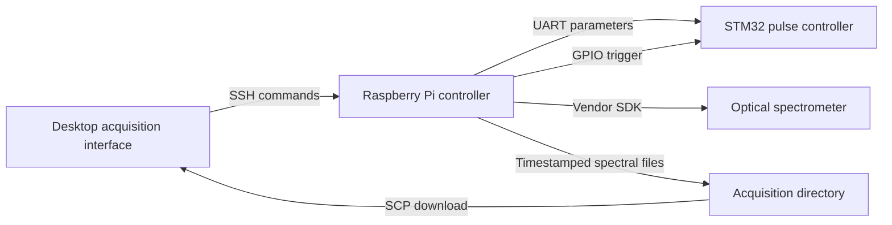

# Laboratory Instrument Control and Spectral Acquisition

Legacy laboratory software connecting a desktop interface, Raspberry Pi, STM32 pulse controller, and optical spectrometer. The repository documents the software interfaces and firmware behind parameterized pulse generation, background acquisition, spectral collection, and transfer of measurement files to the desktop.

The primary implementation uses **Tkinter, Paramiko/SCP, Raspberry Pi GPIO, UART, a vendor spectrometer SDK, and STM32 HAL**. It is a preserved instrument-control implementation, with English documentation and portable configuration added to the copied sources.

## Included components

| Component | Role |
| --- | --- |
| `desktop/` | Acquisition parameter entry, SSH control, SCP download, spectrum plots, and wavelength-based time-series views |
| `raspberry_pi/` | UART command encoding, software coordination of pulse and acquisition threads, background subtraction, and wavelength/intensity file export |
| `firmware/stm32/` | STM32F103C8T6 timer-driven pulse generation, GPIO trigger handling, serial parameter parsing, and stop handling |
| `firmware/contributed_rs485_pulser/` | Separately attributed Arduino/RS485 pulse-controller variant with an I2C LCD |
| `models/` | Original Xcos process-feedback diagram and a readable inventory of its blocks and labels |
| `scripts/` | Static validation and mocked protocol checks that do not access hardware |

The included source covers a legacy pulse/spectrometer instrument. The newer FastAPI application, touchscreen application, multi-pump liquid-handling firmware, and deployed mass-feedback control implementation described elsewhere in the research portfolio were not located in this source collection.

## Architecture



The separate contributed Arduino variant uses its own RS485 address and command layout. It is not a drop-in replacement for the STM32 firmware shown above.

## Start with offline inspection

```bash
python scripts/validate_repository.py
python scripts/check_protocol.py
```

Both commands operate locally without importing GPIO drivers, opening serial ports, loading the spectrometer library, or contacting an instrument. The protocol check uses mocked serial and GPIO interfaces.

## Desktop environment

```bash
python -m venv .venv
python -m pip install -r requirements-desktop.txt
```

Activate the environment first. Tkinter must be available in the Python installation. The source also imports PyQt5 for the preserved interface code.

Copy `desktop/config.example.ini` to `desktop/config.local.ini`, then configure the device username, hostname, remote controller path, and remote acquisition directory. Wavelength selections can be changed in that local file. An optional SSH password is read only from `LAB_PI_PASSWORD`; no original device credentials or private network addresses are included.

After reviewing the device setup and the known limitations, the GUI entry point is `python desktop/control_gui.py`. The interface runs the configured remote controller when acquisition is started.

## Raspberry Pi and firmware

Install `requirements-raspberry-pi.txt` on a compatible Raspberry Pi. Obtain the appropriate UAI spectrometer SDK library from the vendor and set `LAB_SPECTROMETER_LIBRARY` to its absolute path. The original ARM shared library was retained in the private source archive and is not redistributed here.

The STM32 directory contains source, startup code, linker script, the CubeMX `.ioc` configuration, and the supplied HAL/CMSIS drivers with their license notices. Build it with a compatible STM32 toolchain after reviewing the code and wiring. The saved `.ioc` and manually edited source may not be synchronized; regenerating code can overwrite manual changes.

See [hardware and protocol notes](docs/hardware-and-protocol.md) for the original defaults and configuration variables. No firmware was compiled or flashed during preparation, and no actuators or instruments were operated.

## Feedback model

`models/process_feedback_control.zcos` is the original model container, copied byte-for-byte under an English filename. It identifies Scilab 6.1.1 and contains PID, heater, valve, sensor, and temperature-feedback labels. It is included as a **thermal/process feedback simulation example**. It does not establish pump mass-feedback validation or hardware performance. The model was structurally inspected but not simulated.

## Provenance and attribution

Every source file was archived and hashed before curation. Machine-specific configuration, logs, executables, compiled build output, vendor shared libraries, and alternate legacy variants remain in the private archive. Public source hashes are recorded in [the provenance ledger](docs/provenance.json).

The Arduino/RS485 sketch originated in a contributor-named source subfolder. It is included as a contributed legacy variant, without asserting sole authorship or inventing a transliteration of the contributor's name. See [attribution and curation notes](docs/attribution-and-curation.md).

STMicroelectronics and Arm/CMSIS notices are preserved with the vendor files. No repository-wide license was supplied for the custom code or model, so this repository does not assert a new license grant.
