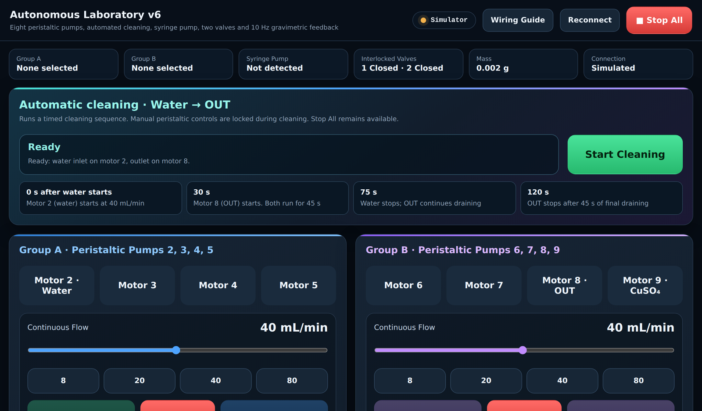
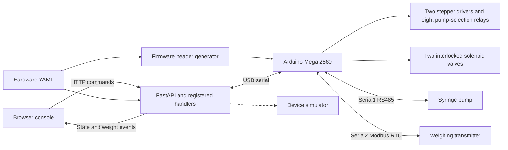
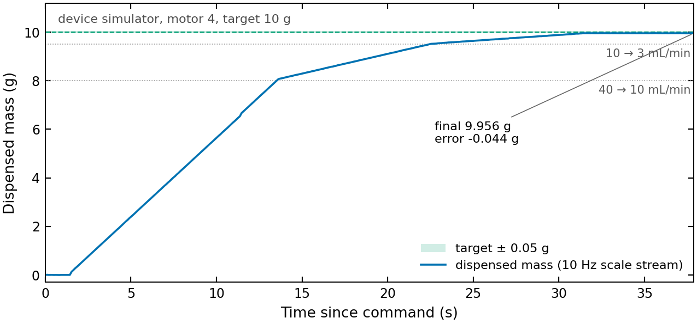

# Autonomous Laboratory for Automated Solution Preparation and Quantitative Analysis

[](https://github.com/liangyuchen-research/laboratory-instrument-control/actions/workflows/checks.yml)

Laboratory automation for liquid preparation, gravimetric dosing and instrument control, developed at the Plasma Engineering Laboratory, National Taiwan University. **Autonomous Laboratory v6** is a FastAPI service, a browser console designed for a touchscreen, and Arduino Mega 2560 firmware that together drive eight peristaltic pumps, a syringe pump, two interlocked solenoid valves and a weighing transmitter over one serial link — with mass-feedback dosing closed around a 10 Hz scale stream.

**Stack:** Python / FastAPI, server-sent events, HTML/CSS/JavaScript, Arduino C++, YAML, RS485, Modbus RTU.



*The console (here on the built-in device simulator, so no hardware is needed to try it): status strip, the timed cleaning sequence, and the two pump groups with continuous-flow, volume-dose and mass-feedback controls.*

## System overview



- **Liquid handling:** continuous pumping, calibrated step-count dosing, and mass-feedback dosing. Two driver groups each select one of four peristaltic pumps through relays, so one pump per group can run at a time.
- **Feedback control:** 10 Hz weight updates, baseline-relative dispensed mass, staged flow reduction (40 → 10 → 3 mL/min), settled final measurements, and aborts on stale readings, stalled delivery, timeout or a global stop.
- **Coordinated operations:** firmware valve interlocks and a water → OUT cleaning sequence; conflicting operations are blocked while cleaning.
- **Service architecture:** 26 registered operations with parameter validation, a single serial owner, cached device state, and live SSE updates to every connected console.
- **Configuration:** one YAML file drives the backend, the startup pin-conflict check and the generated firmware header, so device definitions and wiring stay consistent.



*A 10 g mass-feedback dose on the simulator, recorded with `tools/record_dose_trace.py` and plotted with `tools/plot_dose_trace.py`: fast fill at 40 mL/min, approach at 10 mL/min from 2 g before target, trim at 3 mL/min from 0.5 g before target, then settling and final sampling (−0.044 g, inside the ±0.05 g tolerance). The simulator validates the control logic, not the physical dosing accuracy.*

The earlier Raspberry Pi / STM32 pulse-control and spectrometer-acquisition system is preserved as a separate implementation in [`legacy/instrument-control`](legacy/instrument-control/README.md). Spectrometer acquisition is not yet integrated into the v6 API.

## Try the console

The public configuration defaults to **simulation on localhost**; no Arduino is needed to explore the console or run the checks.

```bash
python -m venv .venv && source .venv/bin/activate      # .venv\Scripts\activate on Windows
python -m pip install -r requirements.txt
python -m backend.main
```

Then open the [console](http://127.0.0.1:8000/), the [wiring and architecture pages](http://127.0.0.1:8000/docs) or the [API documentation](http://127.0.0.1:8000/api/docs); stop with `Ctrl+C`. On Windows, `run.bat` does the same (creates the environment, installs the pinned dependencies, generates the firmware header and opens the console; Python ≥ 3.9). `LAB_CONFIG` selects another YAML file and `SCALE_CALIBRATION_FILE` a separate calibration file.

To reproduce the dosing figure while the service is running:

```bash
python tools/record_dose_trace.py --motor 4 --target-g 10 --out docs/figures/gravimetric_dose_trace.json
python tools/plot_dose_trace.py docs/figures/gravimetric_dose_trace.json
```

## Control behavior

| Operation | Implemented behavior |
| --- | --- |
| Continuous pumping | Flow and direction control for the selected motor in each driver group |
| Volume dosing | Step-count dosing in mL at a fixed 40 mL/min rate |
| Mass-feedback dosing | Target in grams, five baseline samples, 40 → 10 → 3 mL/min stages, seven final samples |
| Flow reduction | 10 mL/min at remaining mass ≤ min(2 g, 25 % of target), then 3 mL/min at ≤ min(0.5 g, 5 % of target) |
| Valve interlocks | Motor 2 / water with valve 1, motor 9 / CuSO₄ with valve 2; the valve opens 1 s before pumping and closes 1 s after stopping |
| Cleaning | Water for 30 s, water and OUT together for 45 s, then OUT (motor 8) alone for 45 s |
| Global stop | Stops both driver groups, the syringe pump and weight streaming, and closes both valves immediately |
| Scale processing | 10 Hz streaming, averaging set to one sample, calibration persistence, CSV export, communication diagnostics |

The mass-feedback tolerance of ±0.5 % is a configured control target, not a measured hardware accuracy. Mass targets are in grams and do not imply the same volume for a liquid of unknown density; three decimals in the console are display precision. The controller waits up to 4 s for a new weight sample, aborts after 30 s without increasing delivered mass, and applies a 300 s deadline to the pumping and top-up phases (baseline collection precedes it; settling and final sampling can extend beyond it). The settling delay after pumping is 5 s. Measurement history lives in backend memory and survives a page refresh, not a restart.

## Hardware configuration

Edit [`config/hardware.yaml`](config/hardware.yaml) before using a physical setup: set the serial port of the connected Mega and change `link.simulate` to `false`. The supplied pin map targets this specific assembly:

| Component | Arduino Mega pins |
| --- | --- |
| Pump-selection relays, motors 2–9 | D2–D9 |
| Driver group A, motors 2–5 | D22 PUL, D23 DIR, D24 ENA |
| Driver group B, motors 6–9 | D25 PUL, D26 DIR, D27 ENA |
| Interlocked valves 1 and 2 | D10 and D11 |
| Syringe-pump RS485, Serial1 | D18 TX1, D19 RX1 |
| Weighing-transmitter RS485, Serial2 | D16 TX2, D17 RX2, D36 DE/RE |

The two RS485 adapters use separate buses. Read the relevant guide before wiring or changing pins: [architecture](docs/architecture.html), [peristaltic pumps and relays](docs/wiring-motors.html), [solenoid valves](docs/wiring-valves.html), [syringe pump](docs/wiring-pump.html), [weight module](docs/wiring-scale.html).

After changing firmware settings, regenerate the header with `python tools/gen_firmware_config.py`. Install the Arduino AVR Boards package and the AccelStepper library (the release was compiled with AVR core 1.8.8 and AccelStepper 1.64.0), open `firmware/Arduino/Arduino.ino` in the Arduino IDE, select Arduino Mega 2560, and upload. Stop the backend before uploading or opening the Serial Monitor — the COM port has one owner — and restart it after configuration changes.

### Calibration

The source assembly uses RUNZE RZ1030B-8 pump heads and DM542J drivers at 8 microsteps (1,600 pulses per motor revolution). Its recorded calibration separates flow-rate conversion from finite-dose conversion:

- 114 mL/min at 400 rpm gives an initial 5,614.035 pulses/mL.
- A motor 2 water test delivered 13.25 mL for a 10 mL setting → shared speed conversion 4,237.008 pulses/mL.
- A subsequent 50 mL setting delivered 46.469 mL → finite-dose conversion 4,558.961 pulses/mL.
- A 50 mL dose therefore uses 227,948 steps at 2,825 steps/s: nominally 80.69 s, excluding acceleration, deceleration and valve sequencing.

These coefficients give equal command timing across channels; they do not establish equal delivered volumes across unmeasured pumps or different tubing and backpressure. The measurements are inherited experiment records and were not repeated for this release. Scale tare and calibration are saved to an untracked `config/scale_calibration.json` and restored at startup; establish them from the console for the connected weighing assembly.

## API

| Endpoint | Purpose |
| --- | --- |
| `GET /fn` | Registered operations and parameter schemas |
| `POST /fn/{name}` | Invoke an operation with a JSON body |
| `GET /api/config` | Configuration used by the console |
| `GET /api/state` | Cached device state |
| `GET /api/stream` | SSE state, weight and serial events |
| `POST /api/reconnect` | Reconnect the controller and restore scale settings |

Operation groups are `motors.*` (8), `pump.*` (9) and `scale.*` (9), all handlers in one persistent service. With the simulator running:

```bash
curl -X POST http://127.0.0.1:8000/fn/motors.dose \
  -H "Content-Type: application/json" \
  -d '{"motor":3,"volume_ml":2,"direction":1}'
```

`GET /fn` gives the current parameter names and ranges. The service is meant for a local laboratory control computer and has no authentication for an internet-facing deployment.

## Verification

```bash
python tools/selftest.py                      # 105 checks against a real local server with simulation forced on
python -m unittest tools.test_regressions     # focused regressions
```

The self-test uses temporary configuration and calibration files and checks configuration validation, generated firmware settings, device commands and conversions, malformed requests, SSE weight events, interlock and cleaning behaviour, and frontend/API consistency. `selftest.bat` is the Windows launcher. Simulator results validate the software; they do not establish physical dosing accuracy, electrical timing, pump reliability or live-instrument compatibility. See the [release verification notes](docs/verification.md).

## Source versions

The root implementation is the autonomous-laboratory **v6** source. Some inherited internal labels say v5; the public interface and documentation use v6. The English edition preserves the pin map, control commands, timing constants and dosing coefficients, with the input-validation and serial-timeout fixes listed in the verification notes. Diagnostic completion messages use `SCAN,DONE` and `SNIFF,TOTAL`; use the backend and firmware from the same checkout. The earlier repository contents remain under `legacy/instrument-control/` with their Git history; vendor license notices stay with those files.
