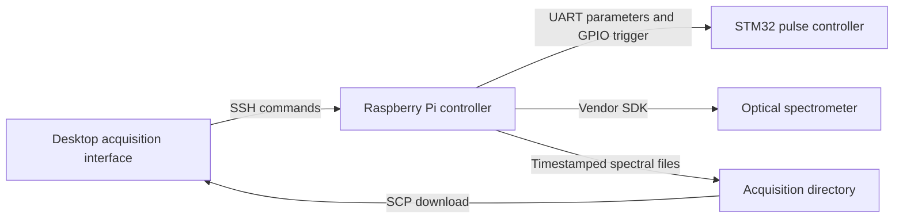

# Laboratory Instrument Control and Spectral Acquisition

Desktop-to-instrument control software for pulsed plasma experiments and optical spectroscopy. A Tkinter interface sends acquisition parameters to a Raspberry Pi, which coordinates an STM32 pulse controller and a spectrometer, then returns spectra for plotting and time-series analysis.

**Technologies:** Python, Tkinter, Paramiko/SCP, Raspberry Pi GPIO, UART, STM32 HAL, Scilab/Xcos.

## System architecture



The controller supports background acquisition, raw or background-subtracted spectra, and wavelength-based time-series plots. Pulse and acquisition threads use software coordination. Measured synchronization accuracy is not available.

| Directory | Contents |
| --- | --- |
| `desktop/` | Parameter entry, remote control, file transfer, and spectrum visualization |
| `raspberry_pi/` | UART command encoding, pulse/acquisition coordination, and spectral export |
| `firmware/stm32/` | STM32F103C8T6 pulse generation, serial parsing, and trigger handling |
| `firmware/contributed_rs485_pulser/` | Separately attributed Arduino/RS485 controller variant |
| `models/` | Scilab/Xcos thermal feedback model |
| `scripts/` | Offline source, protocol, and failure-handling checks |

**Related research:** Autonomous Laboratory for Automated Solution Preparation and Quantitative Analysis, Plasma Engineering Laboratory, National Taiwan University. This directory preserves the earlier pulse/spectrometer instrument. The current FastAPI and multi-pump liquid-handling implementation is documented in the [main README](../../README.md).

## Offline checks

Run from this `legacy/instrument-control/` directory:

```bash
python scripts/validate_repository.py
python scripts/check_protocol.py
python scripts/check_desktop.py
python scripts/check_acquisition.py
```

These checks validate Python syntax, firmware command fields, remote-failure handling, exported-spectrum parsing, worker failure cleanup, and model-file structure using in-memory substitutes for serial, GPIO, and SSH. They do not access hardware. The acquisition parser checks require NumPy and pandas from `requirements-desktop.txt`.

## Desktop setup

Create and activate a Python environment, then install the dependencies:

```bash
python -m venv .venv
```

Activate the environment (`.venv\Scripts\activate` on Windows, or `source .venv/bin/activate` on Linux/macOS), then install:

```bash
python -m pip install -r requirements-desktop.txt
```

Tkinter must be available in the Python installation. Copy `desktop/config.example.ini` to `desktop/config.local.ini` and set the instrument username, hostname, remote controller path, and acquisition directory. Optional password authentication reads `LAB_PI_PASSWORD`; Paramiko can also use SSH keys.

After configuring the instrument:

```bash
python desktop/control_gui.py
```

The interface supports raw and background-subtracted acquisition. Unimplemented designer controls are hidden. **Close UI** closes the desktop window; it does not cancel an active remote acquisition. The current Raspberry Pi exporter and desktop reader share the same timestamp/parameter filename format. Background files are excluded from measurement plots, and already corrected spectra are not background-subtracted a second time.

## Hardware setup and limitations

Install `requirements-raspberry-pi.txt` on the Raspberry Pi. Obtain the UAI spectrometer SDK for the device and set `LAB_SPECTROMETER_LIBRARY` to its library path. The vendor binary is not included.

The STM32 sources target STM32F103C8T6. A standalone, compile-only build uses Python and Arm GNU Toolchain:

```bash
python firmware/stm32/build.py
```

Put the toolchain's `bin` directory on `PATH`, or supply `--toolchain /path/to/toolchain/bin`. The script produces ELF, HEX and BIN files under the ignored `firmware/stm32/build/` directory and never flashes a board. It compiled and linked successfully with Arm GNU GCC 7.2.1. The linker compatibility copy omits newer `READONLY` annotations while preserving the archived source linker script. Review wiring, timer settings and manually edited firmware before any hardware use; the saved CubeMX configuration may not include all source changes.

The separately attributed Arduino variant uses a different protocol. It requires the Arduino AVR Boards package and **LiquidCrystal I2C 1.1.2**. It compiled for `arduino:avr:uno` using AVR core 1.8.8; this establishes build compatibility, not the identity or validation of the original physical board.

See [hardware and protocol notes](docs/hardware-and-protocol.md) for pin assignments, command fields, and known timing and cancellation limitations. Graphical operation with live instruments and physical acquisition remain unverified.

The Xcos model is a thermal feedback example with heater, valve, sensor, and PID blocks. It has been inspected structurally but not simulated, and does not validate pump mass control.

## Attribution

The custom instrument code, contributed Arduino variant, and vendor drivers have distinct provenance. See [attribution and source notes](docs/attribution-and-curation.md) and the [source ledger](docs/provenance.json).

STMicroelectronics and Arm/CMSIS license notices remain with their files. No repository-wide license has been assigned to the custom code or model.
